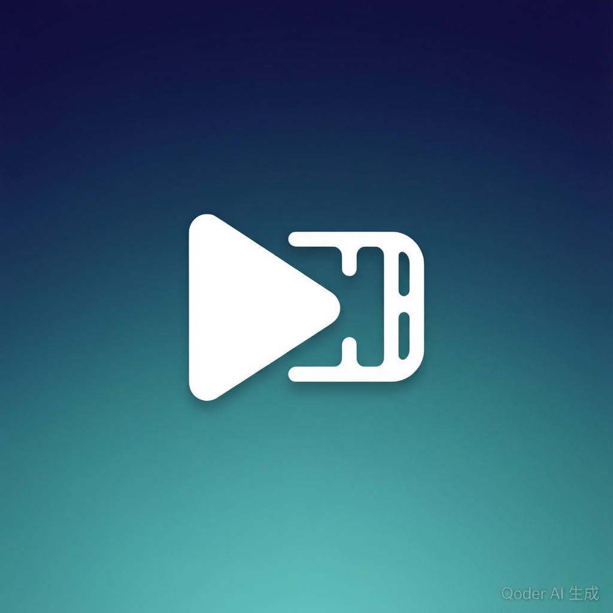

<div align="center">

  

  # Muse

  **AI Video Creation Desktop Tool**

  From script import to full video output — AI-assisted end-to-end creation

  <br/>

  [中文](README.md) · [Apache 2.0 License](LICENSE) · [Releases](https://github.com/MoMoCoder-210/muse/releases)

</div>

---

## Introduction

Muse is a local-first desktop AI video creation tool. It follows a main pipeline — script import → episode decomposition → asset management → shot generation → video synthesis — deeply integrating AI model capabilities into the creative workflow to help you quickly turn text scripts into complete videos.

All data is stored locally by default with no cloud dependency, ensuring creative privacy and data security.

---

## Core Features

| Module | Description |
|---|---|
| 📖 **Script Import** | Import text scripts and auto-split into independent episodes by scene/paragraph |
| 🎬 **Episode Decomposition** | AI parses characters, scenes, items, and shots for each episode |
| 🎨 **Asset Management** | Manage character images, scene environments, and props with AI image generation |
| 🖼️ **Shot Editing** | Generate multiple shots per episode with prompt editing and parameter adjustment |
| 🎙️ **Voice Generation** | Generate TTS voiceovers for shot narration with built-in voice library |
| 🎥 **Video Generation** | Synthesize video episodes from shot frames + voice, supporting multiple resolutions and aspect ratios |
| ✂️ **Video Concatenation** | Merge all videos within an episode into a single final export |
| 🔍 **Video Super-Resolution** | Upscale shot videos to 2x/3x/4x HD using a local ncnn-vulkan engine, with task queue and resume support |

### Supported Art Styles

`Chinese Anime` `Anime` `Japanese Anime` `Korean Manhwa` `ACG` `Live Action`

### Supported Video Specs

Resolution: `480p` `720p` `1080p` `2K` `4K`
Aspect Ratio: `16:9` `9:16` `1:1` `4:3` `3:4` `21:9`

---

## Creative Workflow

```
Script Import ──→ Episodes ──→ Assets ──→ Shots ──→ Video Edit ──→ Video Super-Resolution ──→ Export
```

---

## Tech Stack

| Layer | Technology | Description |
|---|---|---|
| 🖥️ Desktop Shell | **Tauri 2.x** | Cross-platform desktop framework for windowing, IPC, and native APIs |
| 🎨 Frontend | **React 18 + TypeScript + Vite** | UI rendering, invokes backend commands via `@tauri-apps/api` |
| ⚙️ Backend | **Rust** (edition 2021) | File system ops, database management, process lifecycle |
| 🗄️ Database | **SQLite** (WAL mode) | Local storage with concurrent access from Rust and Node worker |
| 🔧 Task Engine | **Node.js 22** (sidecar) | Independent process communicating via stdio JSON-line protocol; handles task scheduling and AI API calls |
| 🎞️ Video | **FFmpeg** | Video concatenation and format conversion |
| 📦 State | **Zustand** + **TanStack Query** | Local UI state and server-data caching |

---

## Architecture

```
┌─────────────────────────────────────────┐
│             React Frontend              │
│   (UI Rendering · Interaction · State)  │
└──────────────┬──────────────────────────┘
               │ Tauri IPC (invoke)
┌──────────────┴──────────────────────────┐
│              Rust Backend               │
│   (Project CRUD · File System · DB Init │
│    Process Mgmt · Event Emission)       │
└──────┬──────────────────┬───────────────┘
       │ spawn & stdio    │ rusqlite
┌──────┴──────┐    ┌──────┴──────┐
│  Node Worker │    │   SQLite    │
│  (Task Sched ·│   │  (Local DB) │
│   AI API Calls)│  └─────────────┘
└──────┬───────┘
       │ HTTP
┌──────┴──────┐
│   LLM API   │
│  (Text/Image/│
│   Voice/Video)│
└─────────────┘
```

**Design Principles:**
- **Three-Layer Separation**: Frontend (UI) → Rust (System) → Node (AI), each with clear responsibilities
- **Task-Driven**: All long-running operations (image/voice/video generation) go through the task queue — direct API calls are forbidden
- **Local-First**: All data stored on the user's machine by default, no cloud dependency
- **Crash Recovery**: Worker crashes are detected and orphaned tasks are automatically reclaimed

---

## Project Structure

```
muse/
├── src/                     # React frontend source
│   ├── components/          # UI components
│   │   ├── common/          #   Shared components (modals, buttons)
│   │   ├── home/            #   Startup screen
│   │   ├── layout/          #   Layout components
│   │   ├── project/         #   Workspace (episodes, assets, shots, video)
│   │   └── settings/        #   Settings panel
│   ├── config/              # Business config (styles, resolutions, workflow)
│   ├── hooks/               # Custom hooks
│   ├── services/            # Tauri command wrappers
│   ├── styles/              # CSS stylesheets (modular)
│   ├── types/               # TypeScript type definitions
│   └── utils/               # Utility functions
│
├── src-tauri/               # Tauri + Rust backend
│   ├── src/
│   │   ├── main.rs          # Binary entry point
│   │   ├── lib.rs           # App init, plugin registration, startup flow
│   │   ├── commands/        # Tauri command implementations
│   │   ├── app_paths.rs     # Path resolution (data dir, FFmpeg, Node)
│   │   ├── sidecar.rs       # Worker process lifecycle management
│   │   └── project_log.rs   # Logging system
│   ├── capabilities/        # Tauri permission declarations
│   ├── icons/               # App icons
│   └── tauri.conf.json      # Tauri configuration
│
├── worker/                  # Node.js sidecar (independent npm workspace)
│   ├── src/
│   │   ├── index.ts         # Entry: stdio communication, command dispatch
│   │   ├── task-runner.ts   # Task engine (polling, locking, retries)
│   │   ├── handlers/        # Task handlers (decomposition, image, voice, video, concat)
│   │   ├── clients/         # AI API client wrappers
│   │   ├── config/          # Worker-side config and defaults
│   │   ├── prompts/         # Model prompt templates
│   │   └── utils/           # Utility functions
│   └── dist/                # Build output
│
├── ffmpeg/                  # FFmpeg binaries
├── migrations/              # Database migration scripts
├── scripts/                 # Build helper scripts
└── docs/                    # Design documentation
```

---

## Data Directory

Runtime data is stored in a hidden folder under the user's home directory:

```
~/.muse/                     # App data directory
├── settings.json            # App configuration (API keys, model params)
├── app.sqlite               # App database (project registry)
├── workspace/               # Default project workspace
└── logs/
    └── muse.log             # Runtime logs

<project-directory>/         # Specified when creating a project
├── project.sqlite           # Project database
├── source/                  # Original script files
├── clips/                   # Episode-related files
├── assets/                  # Asset images and thumbnails
├── storyboards/             # Shot drafts and finals
├── audio/                   # Voice audio files
├── video/                   # Generated video episodes
├── exports/                 # Final exports
└── cache/                   # Temporary cache
```

---

## Getting Started

### Prerequisites

- **Node.js** ≥ 22
- **Rust** ≥ 1.77 (install via [rustup](https://rustup.rs/))
- **Windows** 10+ / **macOS** 12+ / **Linux**

### Development

```bash
# 1. Install frontend dependencies
npm install

# 2. Install Worker dependencies
npm install -w worker

# 3. Build the Worker
npm run worker:build

# 4. Start the development environment
npm run tauri:dev
```

### Production Build

```bash
npm run tauri:build
```

Build artifacts are located at `src-tauri/target/release/bundle/`.

### Common Commands

| Command | Description |
|---|---|
| `npm run tauri:dev` | Start full dev environment (Vite + Tauri) |
| `npm run tauri:build` | Build production installer |
| `npm run dev` | Start Vite dev server only |
| `npm run build` | Build frontend only |
| `npm run worker:dev` | Worker hot-reload dev mode |
| `npm run worker:build` | Build the Worker |

---

## Model Configuration

- **Text Model**: Open API compatible
- **Image Model**: Open API compatible
- **Video Model**: Volcano Seedance-2.0 series API, other formats not yet supported

Default config at `~/.muse/settings.json`.

---

## Current Limitations

> Due to limited funding, only **Windows 64-bit** has been tested for compatibility, and only the **Seedance-2.0-mini** video model has been verified. Multi-platform support (macOS / Linux) and additional video model integrations are on the roadmap — sponsorship would help prioritize these.

---

## Roadmap

- [x] AI script refinement (polish, expand, rewrite)
- [x] Video super-resolution (local ncnn-vulkan, shipped)
- [ ] Image super-resolution (upcoming in a future release)
- [ ] Agent features (starts after image super-resolution; may focus on bug fixes for a long time with no new features)

---

## Acknowledgements

The video super-resolution feature is powered by the following open-source project:

- [Real-ESRGAN](https://github.com/xinntao/Real-ESRGAN) — local super-resolution engine built on ncnn-vulkan (model & inference approach)

---

<div align="center">
  <sub>Built with Tauri · React · Rust · SQLite · Node.js</sub>
  <br/>
  <sub>Licensed under <a href="LICENSE">Apache 2.0</a></sub>
</div>
